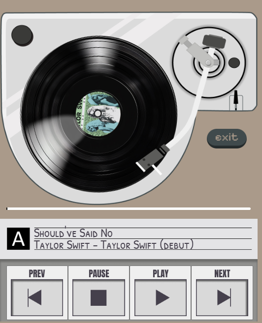

# desktop-music-player
A music player desktop app built with HTML, CSS AND JavaScript using Electron.js framework. 
Currently, this app consists of 11 Taylor Swift songs. 

### How to use the player
1. Download the repository.
2. Go into the desktop-music-player directory with the command `cd desktop-music-player`
3. Run `npm run start` in the console to start the app.

### Add songs to the music player
To add more songs, 
1. Download the song in mp3 format 
2. Add the audio file to `desktop-music-player\audio`. 
3. For the CD image, the album cover of the songs should be edited onto a CD png file, and stored in `desktop-music-player\assests\albums`.
4. Update script.js in the following places:     
    a. title of song -> song_title
    b. name of audio file -> songs
    c. CD image -> album_song
    d. Album of the song -> album_title